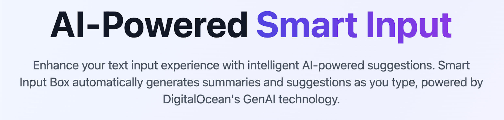

# Smart Input Box



AI-powered smart input component with automatic text summarization using DigitalOcean GenAI Chat Agent. Built with Vue 3, Nuxt 3, and TypeScript.


## Features

🤖 **AI-Powered Suggestions** - Automatic text summarization using DigitalOcean GenAI  
⚡ **Real-time Processing** - Monitors connected textareas with intelligent debouncing  
🎨 **Beautiful UI** - Modern design with Nuxt UI and smooth animations  
🔧 **Highly Configurable** - Customizable triggers, retries, and behavior  
📦 **Multiple Instances** - Support for multiple smart inputs on the same page  
🛡️ **Type Safe** - Full TypeScript support with comprehensive type definitions  
🚀 **Production Ready** - Error handling, retry logic, and performance optimizations  

## Demo


Visit the interactive demo to see the Smart Input Box in action:

```bash
npm run dev
```

Then open [http://localhost:3000](http://localhost:3000) in your browser.

## Quick Start

### Installation

1. **Clone the repository**
   ```bash
   git clone <repository-url>
   cd smart-input-box
   ```

2. **Install dependencies**
   ```bash
   npm install
   # or
   pnpm install
   # or
   yarn install
   ```

3. **Set up environment variables**
   ```bash
   cp .env.example .env
   ```
   
   Edit `.env` and add your DigitalOcean GenAI credentials:
   ```bash
   NUXT_AGENT_ENDPOINT=https://rm3atnymbbmeazfftkvdcxxu.agents.do-ai.run/
   NUXT_AGENT_ACCESS_KEY=your_digitalocean_genai_token_here
   ```

4. **Start development server**
   ```bash
   npm run dev
   ```

### Basic Usage

```vue
<template>
  <div>
    <!-- Smart Input Box -->
    <SmartInput
      v-model="summary"
      connected-textarea="my-textarea"
      placeholder="AI suggestions will appear here..."
      @suggestion-applied="onSuggestionApplied"
    />
    
    <!-- Connected Textarea -->
    <textarea
      id="my-textarea"
      v-model="content"
      placeholder="Type your content here..."
    />
  </div>
</template>

<script setup>
import SmartInput from '~/components/SmartInput/SmartInput.vue'

const summary = ref('')
const content = ref('')

const onSuggestionApplied = (value) => {
  console.log('Applied suggestion:', value)
}
</script>
```

## Configuration

### Component Props

| Prop | Type | Default | Description |
|------|------|---------|-------------|
| `connectedTextarea` | `string` | `undefined` | ID or selector of connected textarea |
| `placeholder` | `string` | `"Enter text..."` | Input placeholder text |
| `modelValue` | `string` | `""` | Input value (v-model) |
| `disabled` | `boolean` | `false` | Disable the input |
| `minChars` | `number` | `20` | Minimum characters to trigger API |
| `debounceMs` | `number` | `500` | Debounce delay in milliseconds |
| `maxRetries` | `number` | `3` | Maximum API retry attempts |
| `retryDelayMs` | `number` | `1000` | Initial retry delay |

### Events

| Event | Payload | Description |
|-------|---------|-------------|
| `update:modelValue` | `string` | Input value changed |
| `suggestion-received` | `SummaryResponse` | AI suggestion received |
| `suggestion-applied` | `string` | Suggestion was applied |
| `api-call-started` | `void` | API request started |
| `api-call-failed` | `Error` | API request failed |
| `api-call-completed` | `void` | API request completed |

### Environment Variables

```bash
# Required
NUXT_AGENT_ENDPOINT=https://rm3atnymbbmeazfftkvdcxxu.agents.do-ai.run/
NUXT_AGENT_ACCESS_KEY=your_token_here

# Optional
NUXT_DEV_MODE=true
NUXT_LOG_LEVEL=info
```

## API Integration

### DigitalOcean GenAI Chat Agent

The component integrates with DigitalOcean's GenAI Chat Agent using the OpenAI-compatible API:

```typescript
const response = await axios.post(
  `${endpoint}/api/v1/chat/completions`,
  {
    messages: [{ role: 'user', content: text }],
    stream: false,
    include_functions_info: false,
    include_retrieval_info: false,
    include_guardrails_info: false
  },
  {
    headers: {
      'Content-Type': 'application/json',
      'Authorization': `Bearer ${accessKey}`
    }
  }
)
```

### Response Format

The API returns a JSON response that's parsed to extract:

```typescript
interface SummaryResponse {
  summary: string              // Primary summary text
  alt_summary1?: string       // Alternative summary
  alt_summary2?: string       // Alternative summary
  lang?: string              // Detected language
  corrected_text?: string    // Grammar-corrected text
}
```

## Advanced Usage

### Multiple Instances

```vue
<template>
  <div>
    <!-- First Smart Input -->
    <SmartInput
      v-model="summary1"
      connected-textarea="textarea1"
      placeholder="Summary for first text..."
    />
    <textarea id="textarea1" v-model="content1" />
    
    <!-- Second Smart Input -->
    <SmartInput
      v-model="summary2"
      connected-textarea="textarea2"
      placeholder="Summary for second text..."
    />
    <textarea id="textarea2" v-model="content2" />
  </div>
</template>
```

### Custom Configuration

```vue
<template>
  <SmartInput
    v-model="summary"
    connected-textarea="custom-textarea"
    :min-chars="50"
    :debounce-ms="1000"
    :max-retries="5"
    @suggestion-received="handleSuggestion"
    @api-call-failed="handleError"
  />
</template>

<script setup>
const handleSuggestion = (response: SummaryResponse) => {
  console.log('Received:', response.summary)
  if (response.alt_summary1) {
    console.log('Alternative:', response.alt_summary1)
  }
}

const handleError = (error: Error) => {
  console.error('API Error:', error.message)
  // Custom error handling
}
</script>
```

### Programmatic Control

```vue
<template>
  <SmartInput
    ref="smartInputRef"
    v-model="summary"
    connected-textarea="my-textarea"
  />
</template>

<script setup>
const smartInputRef = ref()

// Manually trigger suggestion generation
const generateSuggestion = () => {
  const text = document.getElementById('my-textarea').value
  smartInputRef.value.handleFocusLoss(text)
}

// Clear current suggestion
const clearSuggestion = () => {
  smartInputRef.value.clearSuggestion()
}

// Apply current suggestion
const applySuggestion = () => {
  smartInputRef.value.applySuggestion()
}
</script>
```

## Architecture

### Project Structure

```
smart-input-box/
├── components/
│   └── SmartInput/
│       ├── SmartInput.vue          # Main component
│       ├── SuggestionChip.vue      # Suggestion display
│       └── LoadingSpinner.vue      # Loading states
├── composables/
│   ├── useSmartInput.ts            # Core logic
│   ├── useGenAIAgent.ts            # API integration
│   └── useDebounce.ts              # Utility functions
├── types/
│   └── index.ts                    # Type definitions
├── assets/
│   └── css/
│       └── main.css                # Custom styles
└── pages/
    └── index.vue                   # Demo page
```

### State Management

The component uses Vue 3's Composition API for reactive state management:

- **Input State**: Reactive input value with v-model support
- **Loading States**: Tracks API request lifecycle
- **Error Handling**: Manages retry logic and error states
- **Event System**: Comprehensive event emission for parent integration

### Error Handling

- **Exponential Backoff**: Automatic retry with increasing delays
- **Silent Failures**: Errors don't disrupt user experience
- **Rate Limiting**: Respects API rate limits with retry-after headers
- **Timeout Handling**: 30-second request timeout with cleanup

## Development

### Development Server

```bash
npm run dev
```

### Build for Production

```bash
npm run build
```

### Type Checking

```bash
npm run type-check
```

### Linting

```bash
npm run lint
npm run lint:fix
```

## Troubleshooting

### Common Issues

**API calls not working**
- Check environment variables are set correctly
- Verify DigitalOcean GenAI access token is valid
- Check browser console for error messages

**Suggestions not appearing**
- Ensure textarea has minimum 20 characters
- Verify `connected-textarea` prop matches textarea ID
- Check if textarea loses focus to trigger API call

**Multiple instances interfering**
- Each smart input operates independently
- Use unique textarea IDs for each instance
- Check for JavaScript errors in console

### Debug Mode

Enable debug information in development:

```vue
<SmartInput
  :show-debug-info="true"
  @api-call-started="console.log('API started')"
  @api-call-failed="console.error"
/>
```

## Contributing

1. Fork the repository
2. Create a feature branch: `git checkout -b feature-name`
3. Make your changes with proper TypeScript types
4. Add tests if applicable
5. Commit changes: `git commit -am 'Add feature'`
6. Push to branch: `git push origin feature-name`
7. Submit a pull request

### Development Guidelines

- Follow Vue 3 Composition API patterns
- Maintain TypeScript strict mode compatibility
- Use Nuxt UI components where possible
- Add proper JSDoc comments
- Test with multiple instances
- Ensure responsive design

## License

MIT License - see [LICENSE](LICENSE) file for details.

## Support

For issues and questions:
- Check the [Issues](https://github.com/your-repo/issues) page
- Review the demo implementation
- Check environment variable configuration

## Roadmap

- [ ] Keyboard shortcuts (Ctrl+Right Arrow)
- [ ] Alternative summary options display
- [ ] Corrected text suggestions
- [ ] State persistence across navigation
- [ ] Plugin system for different AI providers
- [ ] NPM package distribution
- [ ] Advanced configuration options
- [ ] Analytics integration
- [ ] Mobile-optimized interface
- [ ] Accessibility improvements
